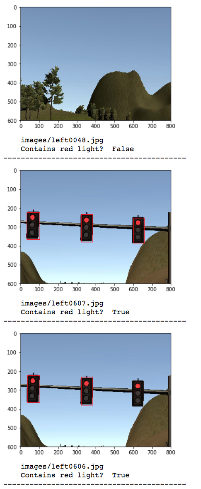
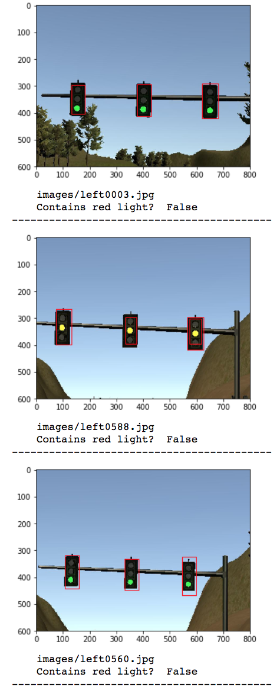
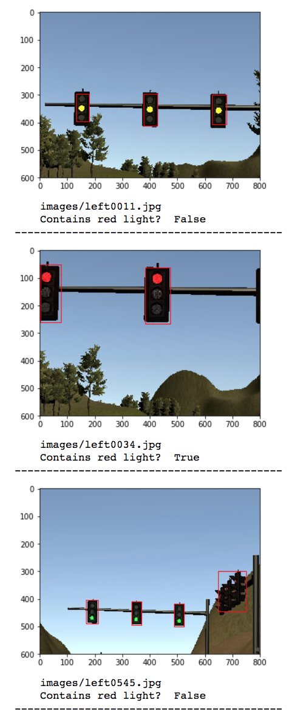
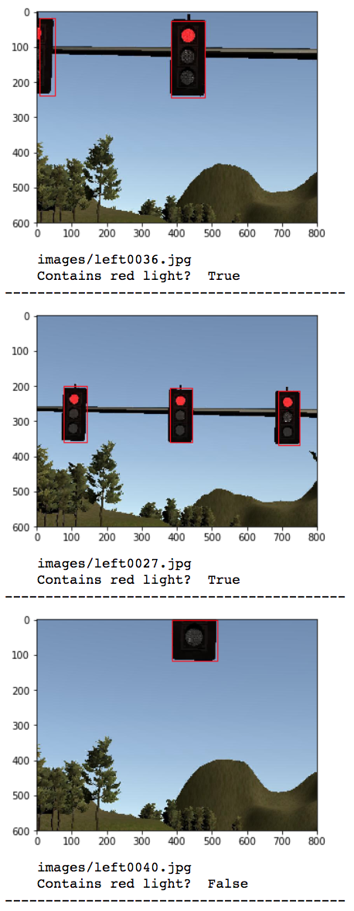

This is the project repo for the final project of the Udacity Self-Driving Car Nanodegree: Programming a Real Self-Driving Car. For more information about the project, see the project introduction [here](https://classroom.udacity.com/nanodegrees/nd013/parts/6047fe34-d93c-4f50-8336-b70ef10cb4b2/modules/e1a23b06-329a-4684-a717-ad476f0d8dff/lessons/462c933d-9f24-42d3-8bdc-a08a5fc866e4/concepts/5ab4b122-83e6-436d-850f-9f4d26627fd9).

# udacity-carnd-capstone
This is the project repo for the final project of the Udacity Self-Driving Car Nanodegree: Programming a Real Self-Driving Car. 

# System Architecture
The following is a system architecture diagram showing the ROS nodes and topics used in the project.


## Traffic Light Detection
Since we know the locations of the traffic lights and the vechile, we can get reduce the classification problem to transformation and detection problem. Color is easier to detect in HSV space. In our use case, red light is very important and in HSV space red has two different ranges, since we want to be very sensitive to red light, I include both range in the the mask. Further improments can be made when dealing with unknown locations and complex data by applying Deep NN solutions.

## Waypoint Updater
The purpose of waypoint updater is to update the target velocity property of each waypoint based on traffic light and obstacle detection data. The target veloicty at normal situdation is given from `waypoint_loader` node. If the red light is detected, we genetated stopping trajectory considering vehicle's deceleration limits. 

## Waypoint Follower
The longitudinal target velocity was set in `waypoint_updater` node. This node determine the target yawrate to keep the lane by using pure-pursuit algorithm.

## DBW(Drive-By-Wire) Node
This node finally calculates throttle, brake and steering angle to follow longitudinal and lateral trajectory simultaneously. We used PID controller to calculate throttle and brake based on the difference between the current velocity and the target velocity. We also use PID controller based on cross-track error (cte) to calculate appropriate steering command.

##Image Classification 
Here are the steps used to detect a red light in the simulator - 

1. Object classification of an image is done using a pre-trained frozen model "ssd_inception_v2_coco_2017_11_17". This neural network is used to detect and classify objects from an image.
2. Each image published on topic /image_color is sent to the neural network for classification. The resulting output is a list of bounding boxed with classified objects. 
3. Class=10 is used to filter traffic lights from the image.
4. Then all traffic lights boxes are pixels are traversed to detect the color of light RED, GREEN, YELLOW or UNKNOWN.
5. If the ratio of RED is more than a particular threshold, over any other color then we classify that the light is RED.
6. This response is sent back to "tl_detector" node to publish it to topic "/traffic_waypoint" which is read by the "waypoint_updater" node.   

## Object Classification Results:





Details on the implementation are available on [Jupyter Notebook](https://github.com/saurabhsoodpec/selfdriving/blob/master/CarND-Capstone/ros/src/tl_detector/light_classification/tl_classifier.ipynb)


#Original documentation and installation details

Please use **one** of the two installation options, either native **or** docker installation.

### Native Installation

* Be sure that your workstation is running Ubuntu 16.04 Xenial Xerus or Ubuntu 14.04 Trusty Tahir. [Ubuntu downloads can be found here](https://www.ubuntu.com/download/desktop).
* If using a Virtual Machine to install Ubuntu, use the following configuration as minimum:
  * 2 CPU
  * 2 GB system memory
  * 25 GB of free hard drive space

  The Udacity provided virtual machine has ROS and Dataspeed DBW already installed, so you can skip the next two steps if you are using this.

* Follow these instructions to install ROS
  * [ROS Kinetic](http://wiki.ros.org/kinetic/Installation/Ubuntu) if you have Ubuntu 16.04.
  * [ROS Indigo](http://wiki.ros.org/indigo/Installation/Ubuntu) if you have Ubuntu 14.04.
* [Dataspeed DBW](https://bitbucket.org/DataspeedInc/dbw_mkz_ros)
  * Use this option to install the SDK on a workstation that already has ROS installed: [One Line SDK Install (binary)](https://bitbucket.org/DataspeedInc/dbw_mkz_ros/src/81e63fcc335d7b64139d7482017d6a97b405e250/ROS_SETUP.md?fileviewer=file-view-default)
* Download the [Udacity Simulator](https://github.com/udacity/CarND-Capstone/releases).

### Docker Installation
[Install Docker](https://docs.docker.com/engine/installation/)

Build the docker container
```bash
docker build . -t capstone
```

Run the docker file
```bash
docker run -p 4567:4567 -v $PWD:/capstone -v /tmp/log:/root/.ros/ --rm -it capstone
```

### Port Forwarding
To set up port forwarding, please refer to the [instructions from term 2](https://classroom.udacity.com/nanodegrees/nd013/parts/40f38239-66b6-46ec-ae68-03afd8a601c8/modules/0949fca6-b379-42af-a919-ee50aa304e6a/lessons/f758c44c-5e40-4e01-93b5-1a82aa4e044f/concepts/16cf4a78-4fc7-49e1-8621-3450ca938b77)

### Usage

1. Clone the project repository
```bash
git clone https://github.com/udacity/CarND-Capstone.git
```

2. Install python dependencies
```bash
cd CarND-Capstone
pip install -r requirements.txt
```
3. Make and run styx
```bash
cd ros
catkin_make
source devel/setup.sh
roslaunch launch/styx.launch
```
4. Run the simulator

### Real world testing
1. Download [training bag](https://s3-us-west-1.amazonaws.com/udacity-selfdrivingcar/traffic_light_bag_file.zip) that was recorded on the Udacity self-driving car.
2. Unzip the file
```bash
unzip traffic_light_bag_file.zip
```
3. Play the bag file
```bash
rosbag play -l traffic_light_bag_file/traffic_light_training.bag
```
4. Launch your project in site mode
```bash
cd CarND-Capstone/ros
roslaunch launch/site.launch
```
5. Confirm that traffic light detection works on real life images
